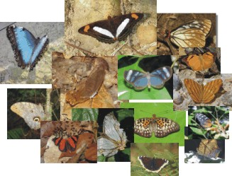
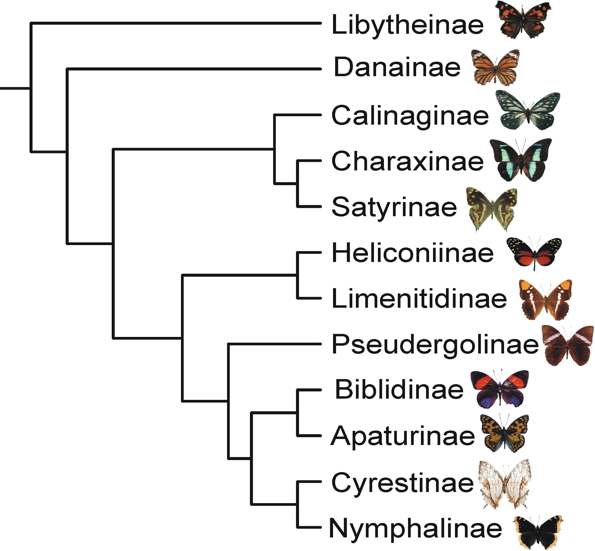
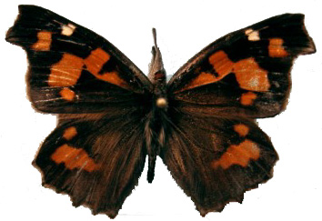
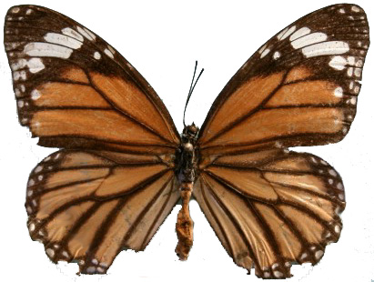
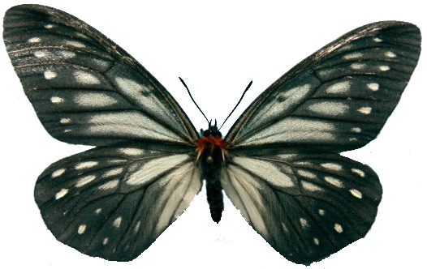
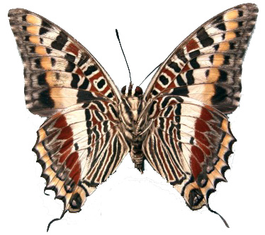
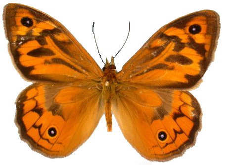
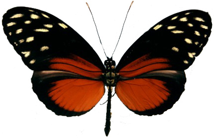
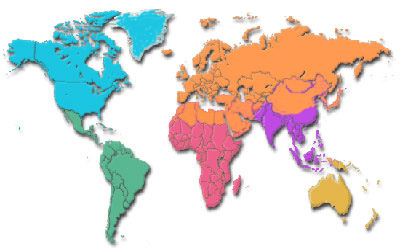

    

        

        <h1>Nymphalidae</h1>
        

        

        

        The butterfly family Nymphalidae contains about 6000 species that have been 
        placed into about <a href="Nymphalidae/Nymphalidae_genera.htm">550 genera</a>.
        Currently these genera are placed into 12 subfamilies and 40 tribes. The 
        relationships of major lineages in Nymphalidae have been unclear for a long 
        period, but recent work by the NSG, Andrew Brower and Andr&eacute; Freitas are
        resolving these issues based on both molecular and morphological data. Other
        colleagues and collaborators have studied the phylogenetic relations of 
        subgroups within Nymphalidae, and these studies are referred to in the relevant
        places throughout our pages. The current state of knowledge of the phylogenetic
        relationships of nymphalid butterflies can be found on the 
        <a href="http://www.tolweb.org/Nymphalidae" target="_blank">Tree of Life web project</a>,
        which the NSG is helping to build up. The 
        <a href="http://www.tolweb.org/Nymphalidae" target="_blank">Tree of Life web project pages</a> 
        will be linked to throughout the NSG pages for phylogenetic hypotheses of the
        various clades in Nymphalidae.
        

    

    

        

        
        

        

        The monophyly of Nymphalidae has been the subject of debate, which was not 
        addressed in the previous studies. Through a collaboration with four other
        labs, the NSG has been able to test the monophyly of Nymphalidae with a 
        large dataset consisting of morphological data and sequences from three 
        genes for a sample of butterflies and skippers. The results of our study 
        showed, among other things, that the family Nymphalidae was monophyletic 
        and sister to Lycaenidae+Riodinidae (see 
        <a href="publi.htm">Wahlberg et al. 2005: Proc. Roy. Soc. 272:1577-1586</a>).
        However, the monophyly of Nymphalidae was not strongly supported and will
        require further study.
        

        

        In addition to broad studies of the whole family, we have been looking in 
        more detail at relationships of species within the subfamily 
        <a href="Nymphalidae/Nymphalinae/Nymphalinae.htm">Nymphalinae</a>, as well
        as <a href="Nymphalidae/Satyrinae/Satyrinae.htm">Satyrinae</a>. With this
        new found understanding of relationships in these groups, we have with our
        collaborators been able to study the evolution of host plant use in the 
        butterflies. In fact our phylogenetic hypotheses for Nymphalidae and 
        Nymphalinae have helped develop an entirely new hypothesis about why 
        phytophagous insects are so speciose. This hypothesis posits that periodical
        broadening of host plant repertoire and subsequent specialization is the 
        driving force behind increased levels of speciation in phytophagous insects 
        (see <a href="http://www.biomedcentral.com/content/pdf/1471-2148-6-4.pdf" target="_blank">Janz et al. 2006</a>).
        

    

    

        

        The large amount of molecular data generated by the NSG is now allowing us 
        to investigate the timing of divergences in various clades. With knowledge
        of when important divergences have happened, we will get a clearer picture 
        of where and how they happened, leading hopefully to a better understanding 
        of how the butterfly family has evolved.
        

        

        The links below to the subfamilies describe the state of knowledge of the
        groups and our possible work on them. Images of voucher specimens are also
        available for a large number of our DNA extracts through our 
        <a href="Vouchers.htm">NSG Voucher Specimen Database</a>. You will also 
        find links to regional checklists with information on species we have 
        sampled and species which we still need for our work.
        

    

    

        <h4>The subfamilies of Nymphalidae</h4>
        <table border="0">
        <tr align="center">
            <td></td>
            <td></td>
            <td></td>
            <td></td>
            <td></td>
            <td></td>
        </tr>
        <tr align="center">
            <td><a href="Nymphalidae/Libytheinae/Libytheinae.htm">Libytheinae</a></td>
            <td><a href="Nymphalidae/Danainae/Danainae.htm">Danainae</a></td>
            <td><a href="Nymphalidae/Calinaginae/Calinaginae.htm">Calinaginae</a></td>
            <td><a href="Nymphalidae/Charaxinae/Charaxinae.htm">Charaxinae</a></td>
            <td><a href="Nymphalidae/Satyrinae/Satyrinae.htm">Satyrinae</a></td>
            <td><a href="Nymphalidae/Heliconiinae/Heliconiinae.htm">Heliconiinae</a></td>
        </tr>
        </table>

    

    

        <h4>Regional Checklists</h4>

        

        <map name="Biomes">
        <area shape="poly" coords="5,5,180,5,165,45,105,120,80,115,5,90" href="Nymphalidae/NAspecies.htm" alt="Nearctic" />
        <area shape="poly" coords="180,5,160,50,175,105,190,120,230,125,240,135,250,120,265,100,285,115,320,105,395,115,395,5" href="Nymphalidae/Palspecies.htm" alt="Palaearctic" />
        <area shape="poly" coords="175,105,195,100,240,110,250,120,250,210,165,210,165,110" href="Nymphalidae/Afrispecies.htm" alt="Afrotropics" />
        <area shape="poly" coords="250,120,265,100,285,115,320,105,325,155,325,173,270,165" href="Nymphalidae/Orientspecies.htm" alt="Oriental" />
        <area shape="poly" coords="325,155,325,173,300,190,300,235,395,235,395,155" href="Nymphalidae/Aust2species.htm" alt="Australasia" />
        <area shape="poly" coords="105,120,80,115,60,110,110,245,160,165" href="Nymphalidae/SAspecies.htm" alt="Neotropics" />
        </map>

        

        <a href="Nymphalidae/NAspecies.htm">Nearctic</a> 
        <a href="Nymphalidae/SAspecies.htm">Neotropics</a>
        <a href="Nymphalidae/Palspecies.htm">Palaearctic</a> 
        <a href="Nymphalidae/Afrispecies.htm">Afrotropics</a> 
        <a href="Nymphalidae/Orientspecies.htm">Oriental</a> 
        <a href="Nymphalidae/Aust2species.htm">Australasia</a> 
        

    

<b>Other information</b>
<ul>
<li><a href="Nymphalidae/Molecular.htm">Preparation of specimens for DNA-studies</a></li>
</ul>
