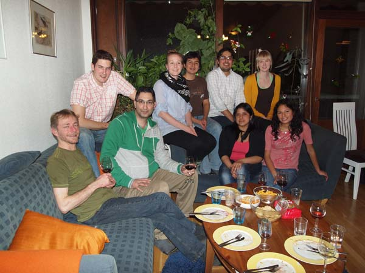
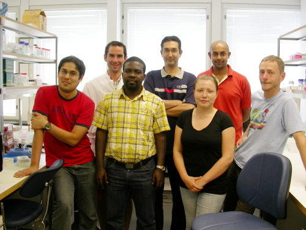

### Members of the NSG

    

        

            

                <ul>
                    <li><a href="Wahlberg.htm">Niklas Wahlberg</a></li>
                    <ul>
                        <li>University Researcher at the Laboratory of Genetics, Department of Biology, University of Turku</li>
                    </ul>
                    <li><a href="http://nymphalidae.utu.fi/cpena/" target="_blank">Carlos Pe&ntilde;a</a></li>
                    <ul>

    <li>Postdoc at the Laboratory of Genetics, Department of Biology, University of Turku working on rates of diversification in Lepidoptera, as well as continuing to develop the NSG Voucher Database</li>
    </ul>
<li>Tobias Malm</li>
    <ul>
    <li>Postdoc at the Laboratory of Genetics, Department of Biology, University of Turku working on rates of diversification in Hymenoptera, as well as continuing to develop the NSG Voucher Database</li>
    </ul>
<li>Terhi Honkola</li>
   <ul>
   <li>Postgraduate student at the Department of Biology, University of Turku working on the evolution of the Finno-Ugric languages</li>
   </ul>
<li>Eero Vesterinen</li>
   <ul>
   <li>Postgraduate student at the Department of Biology, University of Turku working on the diet of bats using molecular methods</li>
   </ul>
</ul>
            

            

	            

	            
Niklas, Eero, Reza, Anu, Pavel, Carlos, Evelyn, Terhi, Carol

            

        

    

### Former members of NSG:

    

        

            

<ul>
<li>Elisabet Weingartner</li>
    <ul>
    <li>PhD on speciation in <i>Polygonia</i>, <i>Pararge</i> and <i>Celastrina</i> at Department of Zoology, Stockholm University. Defended her thesis in October 2008, thesis title "Phylogenetic perspective on host plant use, colonization and speciation in butterflies".</li>
    </ul>
<li>Kwaku Aduse-Poku</li>
   <ul>
   <li>Master's project on the genus <i>Charaxes</i> in 2008. Currently doing a PhD at Cambridge University with Paul Brakefield</li>
   </ul>
<li>Heike Witthauer</li>
   <ul>
   <li>Undergraduate student from the University of Dresden who has done her Master's thesis in NSG on the genus <i>Erebia</i> in 2010.</li>
   </ul>
<li><a href="http://www.vanasiri.in/" target="_blank">Ullasa Kodandaramaiah</a></li>
    <ul>
    <li>PhD completed in October 2009 at the Department of Zoology, Stockholm University, currently an assistant professor at the Indian Institute of Science Education and Research Thiruvananthapuram (IISER-TVM)</li>
    </ul>
<li><a href="http://users.utu.fi/rezzah/index.html" target="_blank">Reza Zahiri</a></li>
    <ul>
    <li>PhD on Noctuoidea systematics completed in June 2012 at the Laboratory of Genetics, Department of Biology, University of Turku, currently a postdoc at the University of Guelph, Canada</li>
    </ul>
<li><a href="http://nymphalidae.utu.fi/pavel/" target="_blank">Pavel Matos-Maravi</a></li>
   <ul>
   <li>Undergraduate student at the Laboratory of Genetics, Department of Biology, University of Turku who worked on the temporal framework of speciation in Satyrinae, currently doing a PhD at the University of South Bohemia, Czech Republic with Milan Janda</li>
   </ul>
<li>Anu Veijalainen</li>
   <ul>
   <li>PhD completed at the Department of Biology, University of Turku working on the diversity of ichneumonid wasps in the Amazon region</li>
   </ul>
</ul>
            

            

                

	                

	                
Carlos, Julien, Kwaku, Reza, Jenni, Ullasa and Niklas

                

            

        

    

